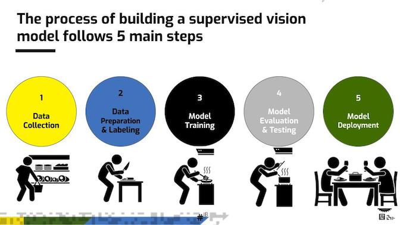
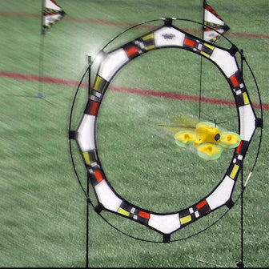

# Session3: Supervised Learning
Learning Machines Workshop -- Session 3: Supervised Learning Activity -- Camera

# Your goal is to build an AI model to automatically drive the drone through a gate
# Follow the Supervised Learning steps to do so:

## This version is using your camera instead of the drone's, and therefor there will be no navigation

# Running the session's activity  
(Note -- You should fllow the repo installiation instruction first)
- Change the directory to `cd session3`
- In the terminal paste/type: `jupyter lab`
